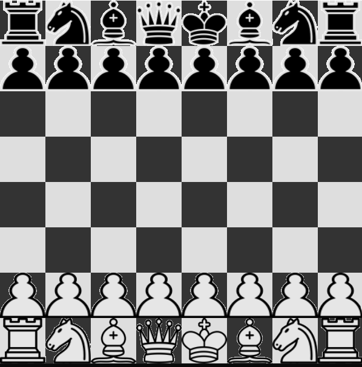

# ChessBrain
A cross-platform chess engine and user interface made from scratch that also includes an AI. It allows two players to play against each other, but also includes an AI that can play against the player, itself, or another AI. The AI performs poorly, but works nonetheless.

## Features
 - A fully working chess engine that implements most rules (except for castling and pawn promotion)
 - Play against another player locally
 - Play against an AI
 - Get two AIs playing against each other
 - A 2D renderer to visualize the board and interact with it

## Setup
 - Clone the repository `git clone https://github.com/razor7877/ChessBrain.git`
 - Download the dependencies `git submodule update --init --recursive`
 - The project can then be built using the included CMake.
 
It works on Linux (makefile/GCC) and Windows (Visual Studio/MSVC) and might work on MacOS too (untested). There is no platform dependent code.
Python is necessary to run the Flask server for running inferences on the models.

## How it works

 - The engine itself is made using C++ 17
 - The 2D renderer is made in OpenGL 3.3
 - The AI model is a convolutional neural network made with Keras
 - The AI model and dataset are made in Python using a Jupyter Notebook (code heavily inspired from https://github.com/realnihal/Chess-AI-with-TensorFlow)
 - Move prediction uses a minimax algorithm in combination with the AI that attributes a score to a given board
 - A Flask server is used to serve the AI model as a REST API. It consumes FEN representation of a given board, and returns best predicted move as SAN notation (eg. g2g3)
 
 ### Dependencies:

 - GLFW: Windowing, inputs and OpenGL context management
 - glad: OpenGL functions loading
 - libCurl: For making HTTP requests to the Flask server and get move prediction